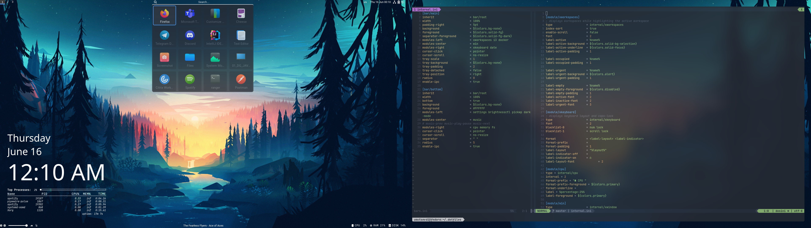
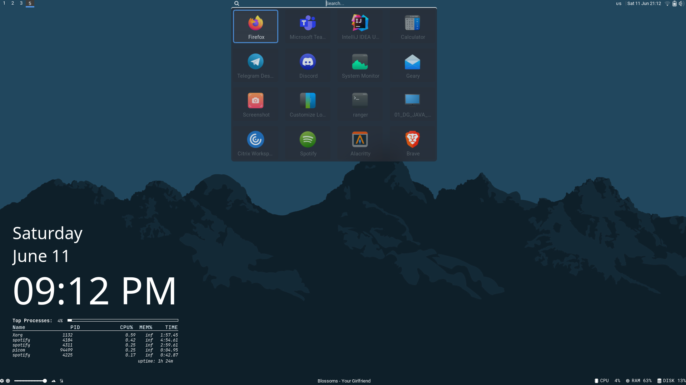
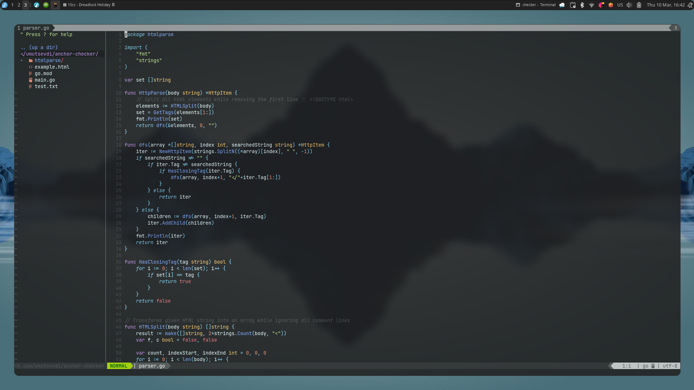

# .dotfiles

<br />
<p align="center">
  <a href="https://github.com/umutsevdi/dotfiles">
    
  </a>
<p align="center">
    Configuration files that I've been using on my computer.
<p align="center">
  
</p>

## About

This repository contains all the configuration files and scripts that I've been using on my device. I use <a href="https://getfedora.org/en/server/download/">Fedora 37 Server Edition</a>. These are the base dotfiles that I start with
when I set up a new environment.

I'm using Fedora 37 on my personal computer. I use the <a href="https://github.com/i3/i3">i3 Window Manager</a>.

<details open="open">
  <summary>Table of Contents</summary>
  <ol>
  <li><a href="rofi-applets/">Applets</a></li>
  <li><a href="bin/">Scripts</a></li>
  <li><a href="nvim/">Neovim</a></li>
  <li><a href="polybar/">Polybar Configurations</a></li>
  <li><a href="i3/config">i3 Configurations</a></li>
  <li><a href="picom/picom.conf">Picom Configurations</a></li>
  </ol>
</details>


---




## How To Install

If you are using Fedora as your operating system, you can just run `install.sh`.

```bash
chmod +x ./install.sh
sudo ./install.sh
```
```
  Disclaimer: run --install with root privileges, --config
with normal user. Run install first with your arguments
Syntax: [-h/C/i [c|n]]

Options:
-h/--help            Prints this menu.
-i/--install         Starts installation. Requires sudo.
-C/--config          Configures system files.
-c/--common          Installs common programs.
-n/--nvidia          Installs Nvidia softwares.
```

It will then download all required files and replace config files with my configurations.

## Aditional Notes

Neovim uses LSP and the latest version available at nightly builds.
* Run Neovim with the pipe argument to make it affected by dark/light mode changes.
```sh
alias nvim='nvim --listen /tmp/$USER.pipe'
sudo npm -g install instant-markdown-d
```



## Credits

- **Wallpaper**: [Wallpaper Creave Packs](wallpapercave.com/)

- **GTK**: [Gruvbox](https://www.gnome-look.org/p/1681313)

- **Icons**: [Kora-Green](https://www.gnome-look.org/p/1256209/)

