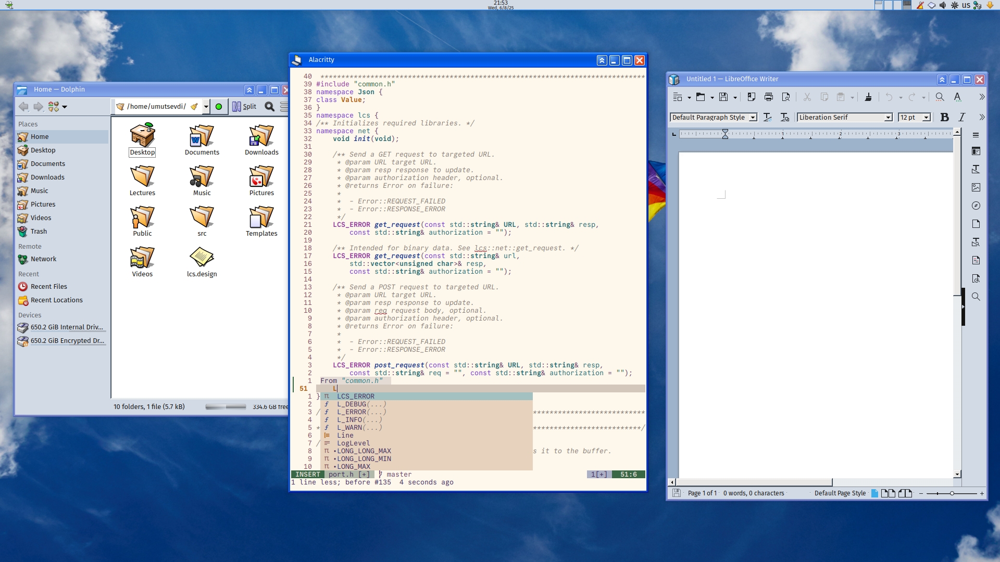

## About

This repository contains all the configuration files and scripts 
I use on my system.
It serves as my starting point whenever I set up a new environment.

##  Theme
| Item | Theme |
| -------------- | --------------- |
| KDE Plasma Style | Expose Blue |
| Window Decorations | Aquarelle Blue |
| QT Icon | Haiku |
| Colors | ReactionarySea/175970-FairytaleMoon |
| Application Style | MS Windows 9x |
| Wallpaper | [Kite by Risto Saukonpää](https://raw.githubusercontent.com/KDE/plasma-workspace-wallpapers/7f7259792d3bfa2361d0cf13a405a3bcc8b2b3e9/Kite/contents/images/2560x1600.jpg) |
| Font | [Commit Mono](https://commitmono.com/) |
| Terminal | [Alacritty](https://alacritty.org/) |

