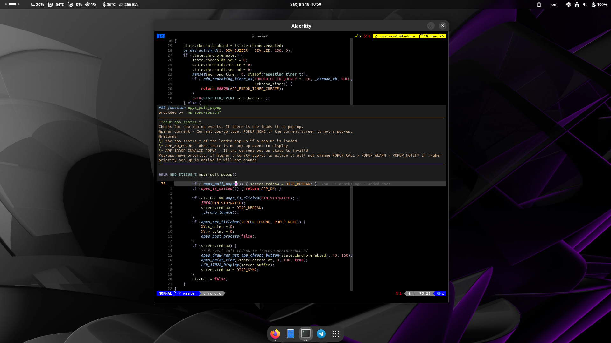

# .dotfiles

<br />
<p align="center">
  <a href="https://github.com/umutsevdi/dotfiles">
    
  </a>
<p align="center">
    Configuration files that I've been using on my computer.
</p>

## About

This repository contains all the configuration files and scripts that I've been
using on my device. I use [Fedora 41](https://getfedora.org/en/server/download/).
These are the base configuration files that I start with when I set up a new
environment.

<details open="open">
  <summary>Table of Contents</summary>
  <ul>
  <li><a href="bin/">Scripts</a></li>
  <li><a href="nvim/">Neovim</a></li>
  <li><a href="tmux.conf">Tmux</a></li>
  <li><a href="alacritty/">Alacritty</a></li>
  </ul>
</details>




## How To Install

If you use Fedora as your operating system, you can just run `install.sh`.

```bash
chmod +x ./install.sh
sudo ./install.sh
```
```
  Disclaimer: run --install with root privileges, --config
with normal user. Run install first with your arguments
Syntax: [-h/C/i [c|n]]

Options:
-h/--help            Prints this menu.
-i/--install         Starts installation. Requires sudo.
-C/--config          Configures system files.
-c/--common          Installs common programs.
-n/--nvidia          Installs Nvidia softwares.
```

