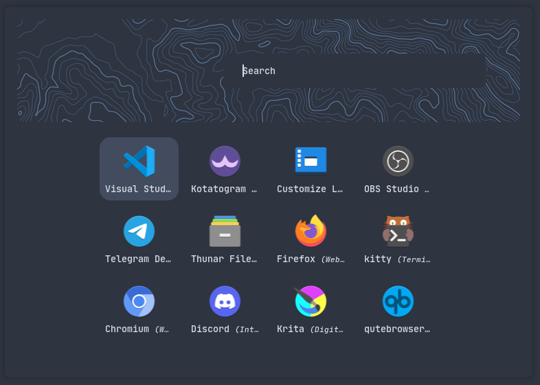
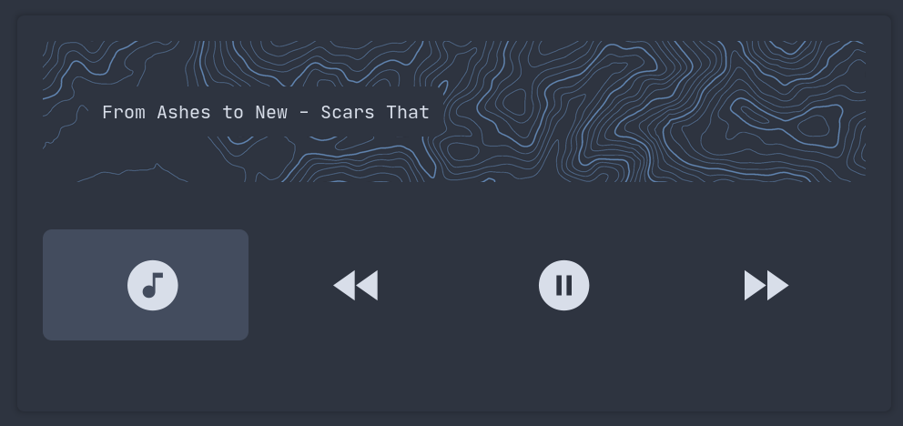
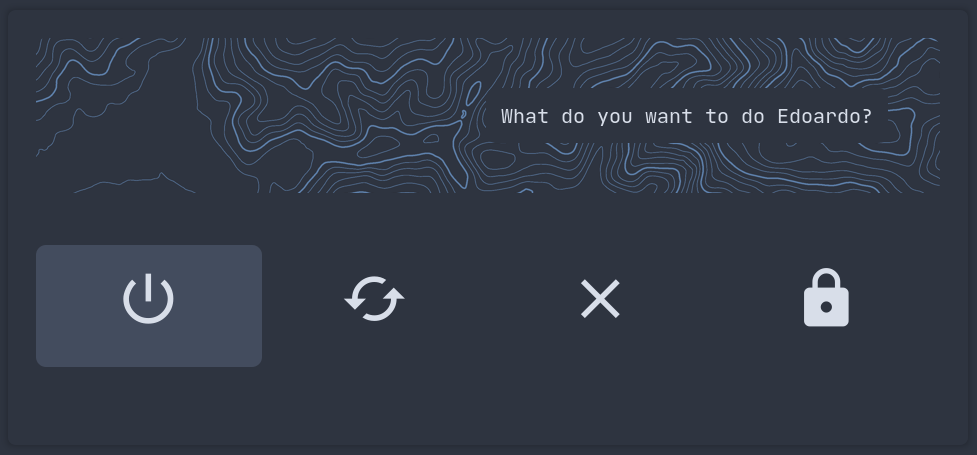
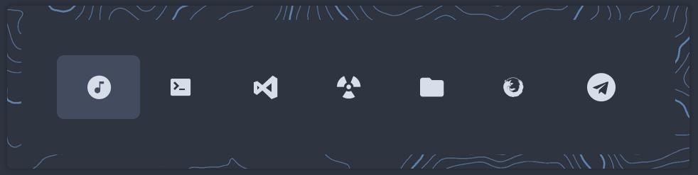
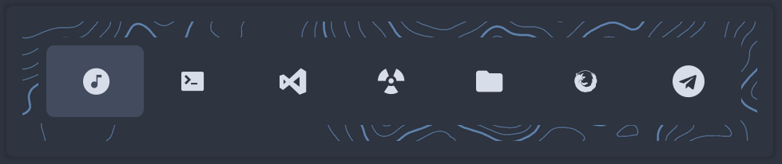
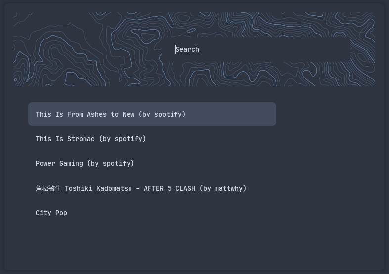

# Rofi Themes
This is a collection of themes

# Requirements

- rofi 1.7.2+ (CSS config style)
- any nerd font like `JetBrainsMonoMedium Nerd Font`
- mpc (for music control)
- i3lock-fancy-dualmonitor (used as a lockscreen)
- bspwm (used in the powermenu)
- ncmpcpp (used in the music control)
- systemd (used to shotdown/reboot)

# Themes

## Application launcher
Used to launch program

### Usage
```rofi -show drun -theme applications -show-icons```

## Music Control
Used to:
  - open ncmpcpp
  - go to previous track
  - play/pause music
  - go to next track

> all of this is done using mpc and urxvt
### Usage
Use the script `musicontrol.sh` inside the `scripts` folder


## Power Menu
Used to:
  - poweroff
  - restart
  - logout (using `bspc` from `bspwm`)
  - lock the screen (using `i3lock-fancy-dualmonitor`)

### Usage
Use the script `powermenu.sh` inside the `scripts` folder


## Dock
Used to launch programs

### Usage
Use the script `dock.sh` inside the `scripts` folder


## Generic
Used for generic menu like playlist selection, todo, run, etc...

### Usage
```rofi -show run -theme generic```


# Screenshots
## Applications


## Music Control


## Powermenu


## Dock


## Dock with double border


## Generic

